# Maid Showcase System Design

## 1. Goal

This document explains how the system works end-to-end:
- Frontend architecture
- Backend architecture
- Data model
- Authentication and authorization
- Deployment topology
- Main request flows

## 2. Current Tech Stack

- Frontend: React + Vite + React Router + React Query
- Backend: Go + Gin + GORM
- Database: PostgreSQL (Supabase)
- Auth session: App JWT (backend-issued)
- Optional identity provider: Firebase ID token -> backend token exchange
- Hosting: Vercel/Netlify (frontend) + Render (backend) + Supabase (DB)

## 3. High-Level Architecture

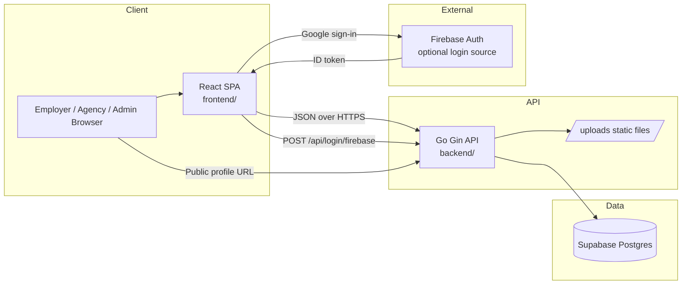

## 4. Runtime Components

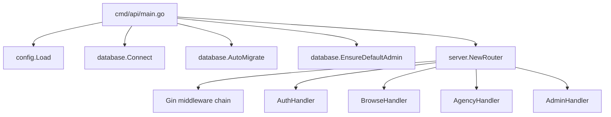

## 5. Backend Design

### 5.1 API Routing

Public:
- `GET /health`
- `GET /public/maids/:id`

Authentication:
- `POST /api/register`
- `POST /api/login`
- `POST /api/login/firebase`

Protected (`JWTAuth`):
- `GET /api/maids`

Agency (`JWTAuth + AgencyOnly`):
- `GET /api/agency/maids`
- `POST /api/agency/maids`
- `PUT /api/agency/maids/:id`
- `DELETE /api/agency/maids/:id`
- `GET /api/agency/contact`
- `PATCH /api/agency/contact`
- `POST /api/agency/subscribe`

Admin (`JWTAuth + AdminOnly`):
- `GET /api/admin/agencies/pending`
- `PATCH /api/admin/agencies/:id/approve`
- `GET /api/admin/subscriptions`
- `PATCH /api/admin/subscriptions/:id/activate`
- `GET /api/admin/visit-stats`

### 5.2 Middleware Pipeline

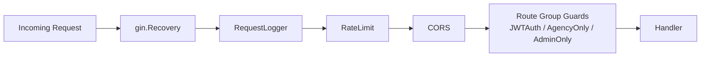

### 5.3 Core Backend Rules

- Agency users must be approved (`users.verified = true`) before successful login.
- Employer users are auto-verified on registration.
- Maid age is validated to be at least 18.
- Browse endpoint returns only `AVAILABLE` maids.
- Agency subscription status can be marked `EXPIRED` when end date passes.
- Backend always runs on real database (no mock runtime mode).

## 6. Authentication Design

### 6.1 Email/Password Login Flow

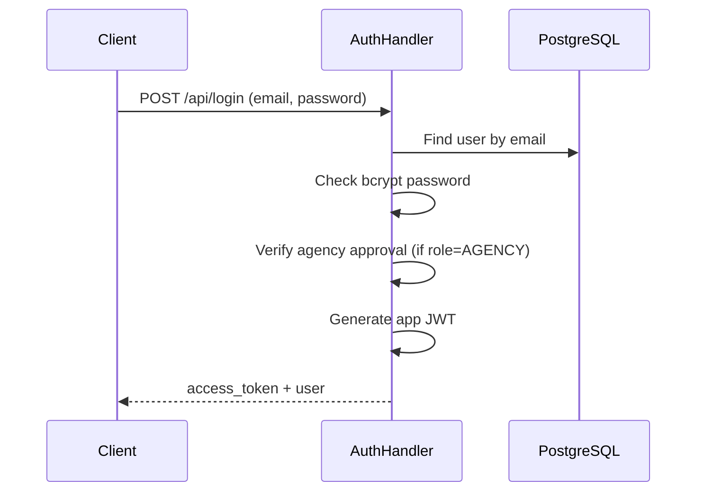

### 6.2 Firebase Login Exchange Flow

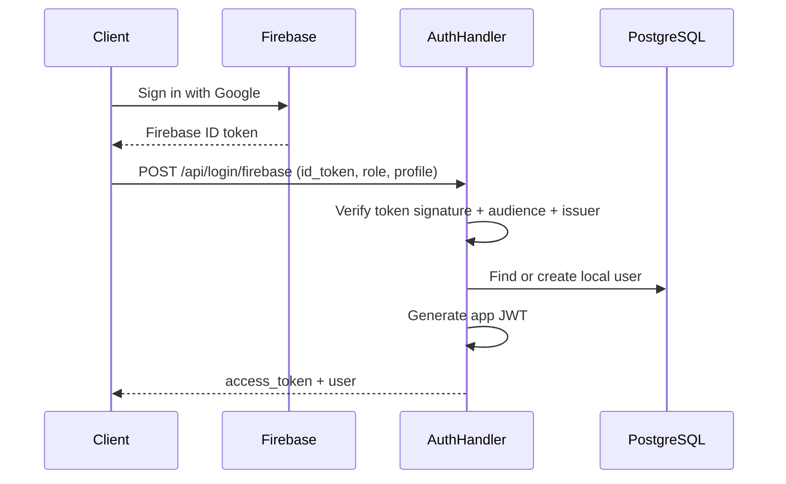

Token model:
- Firebase token is used only as identity proof at login exchange time.
- App session is always maintained by backend JWT for protected API calls.

## 7. Data Model (Logical ERD)

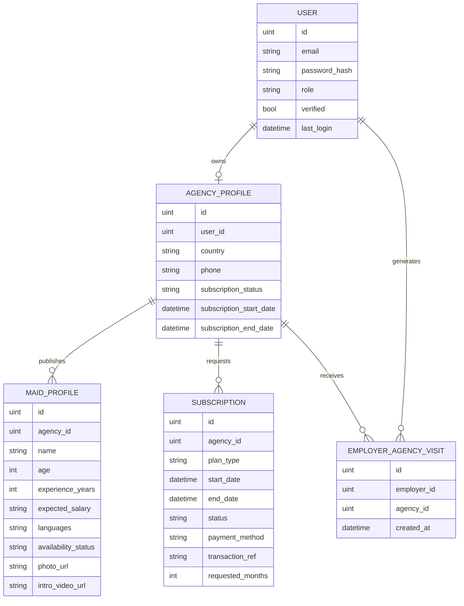

## 8. Main Business Flows

### 8.1 Agency Publishes Profile

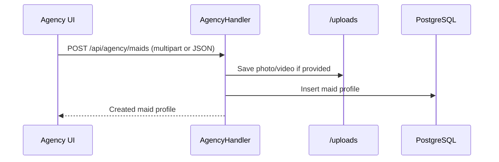

### 8.2 Employer Browses and Contacts Agency

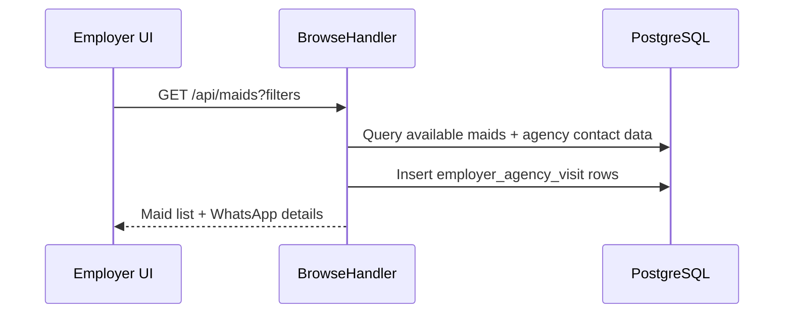

### 8.3 Admin Approval and Activation

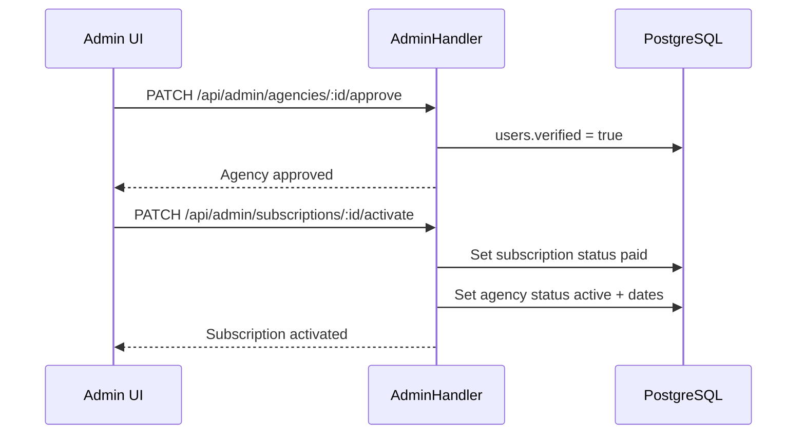

## 9. Frontend Design

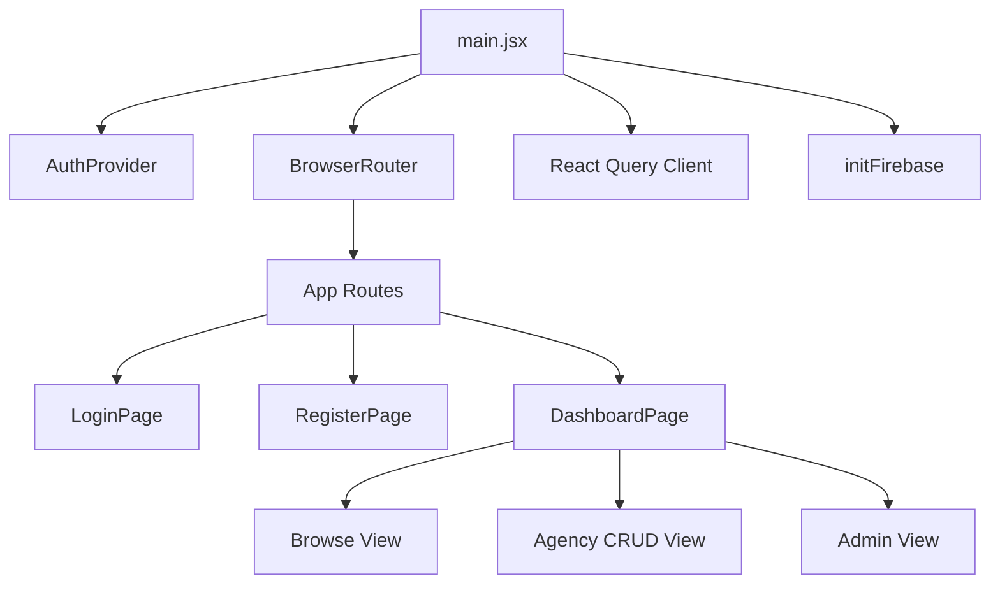

Frontend behavior highlights:
- API base URL is selected from `VITE_API_URL`, with production fallback to Render API.
- Auth context stores app token/user in local storage.
- Firebase is initialized in frontend startup and used for Google sign-in.
- Canonical redirect is applied on Vercel preview hosts to keep auth domain consistent.

## 10. Deployment Topology

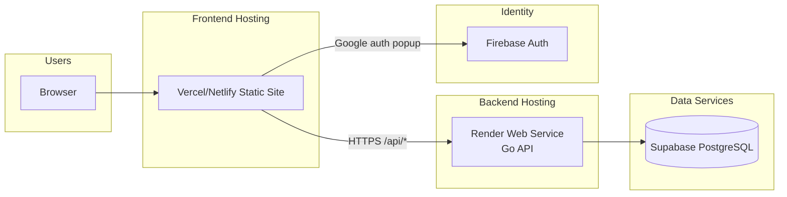

## 11. Configuration Map

Backend (`backend/.env`):
- `PORT`
- `DATABASE_URL`
- `JWT_SECRET`
- `JWT_EXPIRY_MINS`
- `ADMIN_EMAIL`
- `ADMIN_PASSWORD`
- `ALLOWED_ORIGINS`
- `FIREBASE_PROJECT_ID`
- `FIREBASE_CLIENT_EMAIL`
- `FIREBASE_PRIVATE_KEY`

Frontend (`frontend/.env`):
- `VITE_API_URL`
- `VITE_FIREBASE_API_KEY`
- `VITE_FIREBASE_AUTH_DOMAIN`
- `VITE_FIREBASE_PROJECT_ID`
- `VITE_FIREBASE_STORAGE_BUCKET`
- `VITE_FIREBASE_MESSAGING_SENDER_ID`
- `VITE_FIREBASE_APP_ID`
- `VITE_FIREBASE_MEASUREMENT_ID`

## 12. Operational Notes

- Uploads are stored on local filesystem (`/uploads`) on the backend instance.
- For stronger production durability, move media to object storage (for example Supabase Storage).
- Rate limiting is in-memory and per-instance.
- CORS is allow-list based; frontend domains must match backend `ALLOWED_ORIGINS`.

## 13. Quick Mental Model

If you remember only one thing, remember this path:
1. User signs in (email/password or Firebase exchange).
2. Backend issues app JWT.
3. Frontend uses app JWT for all protected API calls.
4. Backend enforces role rules (`ADMIN`, `AGENCY`, `EMPLOYER`) and persists data to Supabase Postgres.
